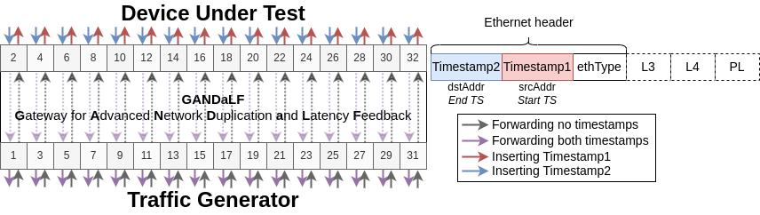

# GANDaLF

**G**ateway for **A**dvanced **N**etwork **D**uplication **a**nd **L**atency **F**eedback

In the overview figure, full timestamping is enabled on all even ports. However, this is fully configurable.

## Description
This is the code for GANDaLF, a high-performance benchmarking assistant for network functions at Tbps rates.

GANDaLF acts as a wire (i.e., hard-wired and transparent forwarding between port pairs), while allowing for configurable packet duplication and timestamp insertion on a per-packet basis.

This will allow for saturation of a high-capacity DUT and incredibly fine-grained latency measurements without requiring expensive traffic generation capabilities.

## Starting GANDaLF
This is assuming that the Tofino is already installec, configured, and ready for pipeline deployment.

1. Modify `start_switch_cpu.sh` to point towards this directory
2. Modify `switch_cpu.py` according to your setup and preferences, so that ports are correctly paired and configured.
3. Compile the GANDaLF P4 pipeline at `p4src/gandalf.p4`
4. Load the pipeline onto the Tofino ASIC
5. Launch the GANDaLF switch-local controller: `./start_switch_cpu.py`

After the bootstrap is completed, GANDaLF should be forwarding packets between port pairs.

You can now manually enable timestamping and duplication on a per-port basis as explained in their individual sections.
A brief guide should also have printed at the end of the bootstrap.

### Latency measurements
To perform nanosecond-granular latency measurements, follow these steps:

1. Connect a traffic generator and the DUT to ports on GANDaLF
2. Configure and enable timestamping according to the cabling
3. Run GANDaLF and the DUT
4. Replay traffic at the traffic generator, and dump the traffic that is coming back from the DUT/GANDaLF
5. Process the dumped traffic through `read_latencies.py`

## Configuring timestamping
Both timestamps are 48-bit integers representing the switch-local time in nanoseconds following IEEE 1588.

*Timestamp1* is inserted into the *ethernet.srcAddr* field when egressing towards the DUT.
*Timestamp2* is inserted into the *ethernet.dstAddr* field when ingressing from the DUT.
Subtracting *Timestamp1* from *Timestamp2* yields the time spent in the DUT, with a tiny latency over-estimation due to propagation towards GANDaLF.

**NOTE:** The DUT is not allowed to modify the Ethernet srcAddr, and should not be dependent on this value for its processing! 
If this is the case, you need to modify the timestamp placement to use another contiguous 48 bits.

The controller function `setTimestamping()` can be used to set up per-port timestamping.

## Configuring duplication
GANDaLF can be configured to do stateless packet duplication per-port through the controller (as determined by the egress port).
This is configured in the controller function `configMulticasting()` by leveraging the packet replication engine through custom multicast groups.

To change the duplication level of an egress port, modify the port entry within the table `tbl_getDuplicationLevel` with your preferred duplication level.
For example `p4.SwitchIngress.tbl_getDuplicationLevel.add_with_set_duplication_level(egress_port=128, num_duplicates=10)` to configure 10x duplication on the DEV_PORT 128. 
Look up the port mapping to find the DEV_PORT of the front panel identifier. Alternatively, modify the default duplication levels within `switch_cpu.py`.

The controller function `setDuplicationLevel()` can be used to set up per-port duplication.

The duplicates will be sent with an incredibly low IPG (assuming low link saturation). 
Preliminary tests show a timestamp difference of about **18 nanoseconds**.

## Development status
- [x] P4-Wire w/ static forwarding
- [x] Timestamp insertion
- [x] Automatic port-map detection
- [x] Packet duplication
- [x] Per-port duplication levels
- [x] Configurable per-port timestamping triggers
- [ ] Automation framework
- [ ] Configurable timestamp placements
